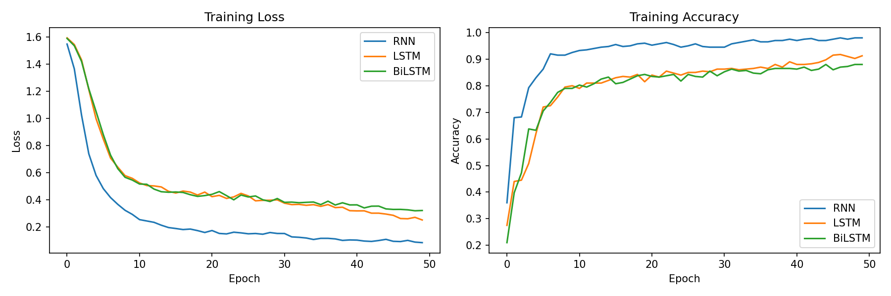
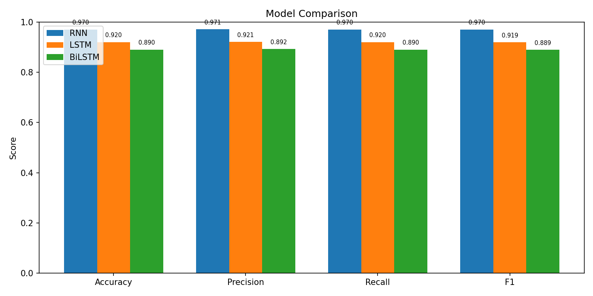
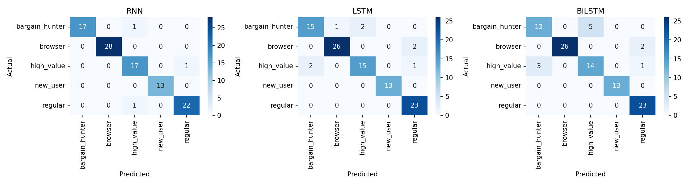

# BÁO CÁO AI SERVICE 02

## Trang bìa

- **Môn học:** Kiến trúc hướng dịch vụ (SOA)
- **Đề tài:** AI Service — Phân loại hành vi người dùng & Knowledge Graph
- **Ngày nộp:** 21/04/2026

---

## 1. Mô tả AI SERVICE

### 1.1 Tổng quan

AI Service là một microservice trong hệ thống e-commerce, chịu trách nhiệm:
- Phân tích hành vi người dùng (8 loại behavior)
- Phân loại khách hàng bằng mô hình Deep Learning (RNN/LSTM/BiLSTM)
- Xây dựng Knowledge Base Graph (KB_Graph) trên Neo4j
- Cung cấp RAG Chat dựa trên KB_Graph
- Tích hợp gợi ý sản phẩm trong e-commerce (search, cart, chat UI)

### 1.2 Kiến trúc hệ thống

```
[Client] → API Gateway (:8080)
                ├── /api/products/*       → product-service (:8001)
                └── /api/ai/*             → ai-service (:8000)
                    ├── /api/behavior/chat/         → RAG Chat (KB_Graph)
                    ├── /api/behavior/segment/<id>/ → Phân loại user
                    ├── /api/behavior/recommend/<id>/ → Gợi ý
                    ├── /api/integration/search/    → Tìm kiếm + gợi ý
                    ├── /api/integration/cart/<id>/  → Giỏ hàng + gợi ý
                    └── /api/integration/chat-ui/   → Giao diện Chat
```

### 1.3 Tech Stack

| Layer | Technology |
|---|---|
| API | Django REST Framework |
| Graph DB | Neo4j (Cypher) |
| Classification | PyTorch (RNN, LSTM, BiLSTM) |
| Data Processing | Pandas, Scikit-learn |
| Visualization | Matplotlib, Seaborn |
| Database | PostgreSQL |

### 1.4 Pipeline xử lý

```
data_user500.csv (Kaggle/REES46)
        ↓
[1] Preprocessing (prepare_user_data.py)
        ↓
[2a] Train RNN/LSTM/BiLSTM (train_behavior_models.py)
        ↓
[2b] Build KB_Graph Neo4j (build_kb_graph.py)
        ↓
[2c] RAG Chat Service (behavior_rag.py)
        ↓
[2d] E-commerce Integration (integration_views.py)
```

---

## 2. Dữ liệu — data_user500.csv

### 2.1 Nguồn dữ liệu

- **Dataset gốc:** eCommerce Events History in Cosmetics Shop (REES46)
- **URL:** https://www.kaggle.com/datasets/mkechinov/ecommerce-events-history-in-cosmetics-shop
- **Mô tả:** Dataset chứa hành vi người dùng thực tế từ cửa hàng mỹ phẩm online, bao gồm các event: view, cart, remove_from_cart, purchase.
- **Xử lý:** Script `prepare_user_data.py` tải và feature engineering thành 8 behaviors cho 500 users.

### 2.2 Cấu trúc dữ liệu

| Cột | Kiểu | Mô tả |
|---|---|---|
| user_id | int | ID người dùng (1-500) |
| view | int | Số lần xem sản phẩm |
| click | int | Số lần click vào sản phẩm |
| cart | int | Số lần thêm vào giỏ hàng |
| purchase | int | Số lần mua hàng |
| search | int | Số lần tìm kiếm |
| wishlist | int | Số lần thêm vào wishlist |
| review | int | Số lần đánh giá |
| share | int | Số lần chia sẻ |
| segment | str | Nhóm khách hàng (label) |

### 2.3 Phân bố Segment

| Segment | Số lượng | Tỷ lệ | Đặc điểm |
|---|---|---|---|
| browser | 139 | 27.8% | Xem nhiều, mua ít |
| regular | 114 | 22.8% | Hành vi trung bình |
| bargain_hunter | 92 | 18.4% | Search nhiều, cart cao |
| high_value | 90 | 18.0% | Purchase cao, review nhiều |
| new_user | 65 | 13.0% | Ít tương tác |

### 2.4 Copy 20 dòng data

```csv
user_id,view,click,cart,purchase,search,wishlist,review,share,segment
1,51,60,4,2,26,8,0,1,browser
2,27,36,13,9,41,8,5,2,bargain_hunter
3,161,62,4,0,25,17,1,1,browser
4,64,29,28,3,64,4,0,3,bargain_hunter
5,43,33,4,0,26,3,0,1,regular
6,72,39,16,10,80,24,1,2,bargain_hunter
7,17,35,9,3,29,2,3,2,regular
8,72,35,24,14,59,28,0,4,bargain_hunter
9,26,47,24,12,19,2,3,5,high_value
10,38,28,24,13,19,10,6,5,high_value
11,35,31,8,3,30,4,0,2,regular
12,74,40,3,1,63,13,1,1,browser
13,39,8,4,2,20,3,0,2,regular
14,79,60,3,0,52,16,1,1,browser
15,127,80,1,1,27,17,2,2,browser
16,23,35,10,14,15,14,3,3,high_value
17,34,30,15,6,30,12,1,1,regular
18,43,32,3,1,24,5,2,2,regular
19,13,8,2,0,11,2,0,0,new_user
20,119,40,6,1,47,23,0,1,browser
```

---

## 3. Câu 2a — Mô hình RNN, LSTM, BiLSTM

### 3.1 Kiến trúc mô hình

Ba mô hình được xây dựng để phân loại user segment từ 8 behavior features:

**Input:** 8 behavior counts → chuẩn hóa (StandardScaler) → reshape thành sequence (8 timesteps × 1 feature)

#### RNN (Recurrent Neural Network)

```python
class RNNClassifier(nn.Module):
    def __init__(self, input_size, hidden_size, num_classes):
        super().__init__()
        self.rnn = nn.RNN(input_size, hidden_size, batch_first=True)
        self.fc = nn.Linear(hidden_size, num_classes)

    def forward(self, x):
        _, h = self.rnn(x)
        return self.fc(h.squeeze(0))
```

#### LSTM (Long Short-Term Memory)

```python
class LSTMClassifier(nn.Module):
    def __init__(self, input_size, hidden_size, num_classes):
        super().__init__()
        self.lstm = nn.LSTM(input_size, hidden_size, batch_first=True)
        self.fc = nn.Linear(hidden_size, num_classes)

    def forward(self, x):
        _, (h, _) = self.lstm(x)
        return self.fc(h.squeeze(0))
```

#### BiLSTM (Bidirectional LSTM)

```python
class BiLSTMClassifier(nn.Module):
    def __init__(self, input_size, hidden_size, num_classes):
        super().__init__()
        self.lstm = nn.LSTM(input_size, hidden_size, batch_first=True, bidirectional=True)
        self.fc = nn.Linear(hidden_size * 2, num_classes)

    def forward(self, x):
        out, _ = self.lstm(x)
        return self.fc(out[:, -1, :])
```

### 3.2 Hyperparameters

| Parameter | Giá trị |
|---|---|
| Hidden dimension | 64 |
| Epochs | 50 |
| Batch size | 32 |
| Learning rate | 0.001 |
| Optimizer | Adam |
| Loss function | CrossEntropyLoss |
| Train/Test split | 80/20 (stratified) |

### 3.3 Kết quả đánh giá

| Mô hình | Accuracy | Precision | Recall | F1-Score |
|---|---|---|---|---|
| **RNN** | **0.9700** | **0.9711** | **0.9700** | **0.9703** |
| LSTM | 0.9200 | 0.9207 | 0.9200 | 0.9192 |
| BiLSTM | 0.8900 | 0.8923 | 0.8900 | 0.8894 |

### 3.4 Classification Report (RNN — Best Model)

```
                precision    recall  f1-score   support

bargain_hunter       1.00      0.94      0.97        18
       browser       1.00      1.00      1.00        28
    high_value       0.89      0.94      0.92        18
      new_user       1.00      1.00      1.00        13
       regular       0.96      0.96      0.96        23

      accuracy                           0.97       100
     macro avg       0.97      0.97      0.97       100
  weighted avg       0.97      0.97      0.97       100
```

### 3.5 Visualization

#### Training Curves (Loss & Accuracy)



#### Model Comparison



#### Confusion Matrices



### 3.6 Đánh giá và lựa chọn mô hình

**Mô hình tốt nhất: RNN** với F1-Score = 0.9703

**Phân tích:**

1. **RNN (F1=0.9703):** Cho kết quả tốt nhất. Với chuỗi hành vi ngắn (8 timesteps), RNN cơ bản đủ khả năng nắm bắt pattern mà không cần cơ chế phức tạp hơn. Không gặp vấn đề vanishing gradient do sequence length ngắn.

2. **LSTM (F1=0.9192):** Cơ chế gate (forget, input, output) của LSTM thêm complexity nhưng không mang lại lợi ích rõ rệt cho sequence ngắn. Có thể bị overfit nhẹ do số parameter nhiều hơn RNN.

3. **BiLSTM (F1=0.8894):** Bidirectional processing tăng gấp đôi số parameter nhưng không cải thiện kết quả. Với 8 behaviors không có thứ tự thời gian rõ ràng, thông tin backward không thêm giá trị đáng kể.

**Kết luận:** Đối với bài toán phân loại hành vi với sequence ngắn và features rõ ràng, mô hình đơn giản (RNN) hoạt động hiệu quả hơn các mô hình phức tạp. Đây là minh chứng cho nguyên tắc Occam's Razor trong Machine Learning.

---

## 4. Câu 2b — Knowledge Base Graph (KB_Graph) với Neo4j

### 4.1 Mô tả

KB_Graph là đồ thị tri thức được xây dựng trên Neo4j, biểu diễn mối quan hệ giữa users, behaviors và segments.

### 4.2 Cấu trúc Graph

| Node Type | Số lượng | Properties |
|---|---|---|
| BehaviorUser | 500 | id, view, click, cart, purchase, search, wishlist, review, share, segment |
| BehaviorType | 8 | name (view, click, cart, purchase, search, wishlist, review, share) |
| Segment | 5 | name (high_value, browser, bargain_hunter, new_user, regular) |

| Edge Type | Số lượng | Mô tả |
|---|---|---|
| HAS_BEHAVIOR | 3,508 | User → BehaviorType (weight = count) |
| CLASSIFIED_AS | 500 | User → Segment |
| SIMILAR_TO | 2,500 | User → User (cosine similarity, top-5) |

**Tổng:** 513 nodes, ~6,508 edges

### 4.3 Code xây dựng KB_Graph

```python
# build_kb_graph.py - Trích đoạn chính

# Tạo constraints
session.run("CREATE CONSTRAINT IF NOT EXISTS FOR (u:BehaviorUser) REQUIRE u.id IS UNIQUE")
session.run("CREATE CONSTRAINT IF NOT EXISTS FOR (s:Segment) REQUIRE s.name IS UNIQUE")
session.run("CREATE CONSTRAINT IF NOT EXISTS FOR (b:BehaviorType) REQUIRE b.name IS UNIQUE")

# Tạo User node với behavior properties
session.run("""
    MERGE (u:BehaviorUser {id: $id})
    SET u.view = $view, u.click = $click, u.cart = $cart,
        u.purchase = $purchase, u.search = $search,
        u.wishlist = $wishlist, u.review = $review, u.share = $share,
        u.segment = $segment
""", **props)

# User → Segment
session.run("""
    MATCH (u:BehaviorUser {id: $uid})
    MATCH (s:Segment {name: $seg})
    MERGE (u)-[:CLASSIFIED_AS]->(s)
""", uid=uid, seg=segment)

# User → BehaviorType (with count)
session.run("""
    MATCH (u:BehaviorUser {id: $uid})
    MATCH (bt:BehaviorType {name: $bname})
    MERGE (u)-[r:HAS_BEHAVIOR]->(bt)
    SET r.count = $count
""", uid=uid, bname=b, count=int(row[b]))

# User similarity (cosine) → SIMILAR_TO edges
sim_matrix = cosine_similarity(features_scaled)
session.run("""
    MATCH (u1:BehaviorUser {id: $uid1})
    MATCH (u2:BehaviorUser {id: $uid2})
    MERGE (u1)-[r:SIMILAR_TO]->(u2)
    SET r.score = $score
""", uid1=uid, uid2=other_uid, score=score)
```

### 4.4 Copy 20 dòng dữ liệu trong Graph

**Cypher Query:** `MATCH (u:BehaviorUser) RETURN u LIMIT 20`

| user_id | view | click | cart | purchase | search | wishlist | review | share | segment |
|---|---|---|---|---|---|---|---|---|---|
| 1 | 51 | 60 | 4 | 2 | 26 | 8 | 0 | 1 | browser |
| 2 | 27 | 36 | 13 | 9 | 41 | 8 | 5 | 2 | bargain_hunter |
| 3 | 161 | 62 | 4 | 0 | 25 | 17 | 1 | 1 | browser |
| 4 | 64 | 29 | 28 | 3 | 64 | 4 | 0 | 3 | bargain_hunter |
| 5 | 43 | 33 | 4 | 0 | 26 | 3 | 0 | 1 | regular |
| 6 | 72 | 39 | 16 | 10 | 80 | 24 | 1 | 2 | bargain_hunter |
| 7 | 17 | 35 | 9 | 3 | 29 | 2 | 3 | 2 | regular |
| 8 | 72 | 35 | 24 | 14 | 59 | 28 | 0 | 4 | bargain_hunter |
| 9 | 26 | 47 | 24 | 12 | 19 | 2 | 3 | 5 | high_value |
| 10 | 38 | 28 | 24 | 13 | 19 | 10 | 6 | 5 | high_value |
| 11 | 35 | 31 | 8 | 3 | 30 | 4 | 0 | 2 | regular |
| 12 | 74 | 40 | 3 | 1 | 63 | 13 | 1 | 1 | browser |
| 13 | 39 | 8 | 4 | 2 | 20 | 3 | 0 | 2 | regular |
| 14 | 79 | 60 | 3 | 0 | 52 | 16 | 1 | 1 | browser |
| 15 | 127 | 80 | 1 | 1 | 27 | 17 | 2 | 2 | browser |
| 16 | 23 | 35 | 10 | 14 | 15 | 14 | 3 | 3 | high_value |
| 17 | 34 | 30 | 15 | 6 | 30 | 12 | 1 | 1 | regular |
| 18 | 43 | 32 | 3 | 1 | 24 | 5 | 2 | 2 | regular |
| 19 | 13 | 8 | 2 | 0 | 11 | 2 | 0 | 0 | new_user |
| 20 | 119 | 40 | 6 | 1 | 47 | 23 | 0 | 1 | browser |

### 4.5 Ảnh Graph

**Neo4j Browser:** http://localhost:7474

**Cypher queries để visualize:**

```cypher
-- Toàn bộ graph structure
MATCH (u:BehaviorUser)-[r]->(target)
RETURN u, r, target LIMIT 100

-- Users theo segment
MATCH (s:Segment)<-[:CLASSIFIED_AS]-(u:BehaviorUser)
RETURN s, u LIMIT 50

-- Similar users network
MATCH (u:BehaviorUser)-[r:SIMILAR_TO]->(other)
WHERE u.id <= 20
RETURN u, r, other

-- Behavior distribution
MATCH (u:BehaviorUser)-[r:HAS_BEHAVIOR]->(b:BehaviorType)
RETURN b.name, count(r), avg(r.count)
```

**Mô tả graph:**
- 500 User nodes kết nối với 8 BehaviorType nodes qua HAS_BEHAVIOR edges
- Mỗi User kết nối với 1 Segment qua CLASSIFIED_AS
- Mỗi User có 5 SIMILAR_TO edges đến users tương tự nhất (cosine similarity trên behavior vector)
- Graph phức tạp với 6,508 edges tạo thành mạng lưới dày đặc

---

## 5. Câu 2c — RAG Chat dựa trên KB_Graph

### 5.1 Kiến trúc RAG

```
User Query → Intent Detection → Graph Retrieval (Neo4j) → RNN Prediction → Response Generation
```

**Không sử dụng external API hay pretrained model.** Toàn bộ pipeline tự xây dựng:

1. **Intent Detection:** Keyword matching cho 5 intents (segment_info, similar_users, behavior_summary, recommend, stats)
2. **Graph Retrieval:** Cypher queries lấy context từ KB_Graph (user data, similar users, segment stats)
3. **RNN Prediction:** Dùng trained RNN model để dự đoán segment
4. **Response Generation:** Template-based response với graph context

### 5.2 Code RAG Service

```python
# behavior_rag.py - Trích đoạn

class BehaviorRAGChat:
    def chat(self, user_id, query):
        # 1. Retrieve user context from KB_Graph
        user_data = self._get_user_from_graph(user_id)

        # 2. Detect intent
        intent = self._detect_intent(query)

        # 3. Retrieve relevant graph context
        if intent == "similar_users":
            context["similar"] = self._get_similar_users(user_id)
        if intent in ("segment_info", "stats"):
            context["segment_stats"] = self._get_segment_stats(user_data["segment"])

        # 4. Predict segment using trained RNN model
        predicted_segment = self._predict_segment(user_data)

        # 5. Generate response (template-based, no external API)
        answer = self._generate_response(user_id, user_data, intent, context)
        return {"answer": answer, "context": context}
```

### 5.3 API Endpoints

| Method | Endpoint | Mô tả |
|---|---|---|
| POST | `/api/behavior/chat/` | RAG Chat — gửi query, nhận answer + context |
| GET | `/api/behavior/segment/<id>/` | Lấy segment prediction cho user |
| GET | `/api/behavior/recommend/<id>/` | Gợi ý dựa trên behavior |

### 5.4 Ví dụ sử dụng

**Request:**
```bash
curl -X POST http://localhost:8080/api/ai/behavior/chat/ \
  -H "Content-Type: application/json" \
  -d '{"user_id": 10, "query": "hành vi của tôi"}'
```

**Response:**
```json
{
  "answer": "Hành vi của user 10:\n  View: 38, Click: 28\n  Cart: 24, Purchase: 13\n  Search: 19, Wishlist: 10\n  Review: 6, Share: 5\nPhân loại: 'high_value' (dự đoán model: 'high_value')",
  "context": {
    "user": {"view": 38, "click": 28, "cart": 24, "purchase": 13, ...},
    "intent": "behavior_summary",
    "predicted_segment": "high_value"
  }
}
```

---

## 6. Câu 2d — Tích hợp trong Hệ E-commerce

### 6.1 Mô tả

Tích hợp AI behavior analysis vào e-commerce qua 3 điểm:

1. **Search + Recommendations:** Khi khách hàng tìm kiếm, hiển thị sản phẩm + gợi ý dựa trên behavior segment
2. **Cart Recommendations:** Khi xem giỏ hàng, gợi ý sản phẩm phù hợp với segment
3. **Chat UI:** Giao diện chat riêng (không phải ChatGPT style) để tương tác với AI

### 6.2 API Endpoints

| Method | Endpoint | Mô tả |
|---|---|---|
| GET | `/api/integration/search/?q=...&user_id=...` | Tìm kiếm + gợi ý theo segment |
| GET | `/api/integration/cart/<user_id>/` | Gợi ý cho giỏ hàng |
| GET | `/api/integration/chat-ui/` | Giao diện Chat HTML |

### 6.3 Search + Recommendations

**Request:**
```bash
curl http://localhost:8080/api/ai/integration/search/?q=shoes&user_id=1
```

**Response:** Trả về danh sách sản phẩm tìm được + recommendations dựa trên graph + user context (segment, behavior).

### 6.4 Cart Recommendations

**Request:**
```bash
curl http://localhost:8080/api/ai/integration/cart/5/
```

**Response:**
```json
{
  "user_id": 5,
  "segment": "regular",
  "recommendations": [
    {"product_id": 103, "name": "Canterbury CCC Thermoreg...", "score": 53},
    {"product_id": 42, "name": "Pirelli Night Dragon...", "score": 47}
  ],
  "suggestion": "User 5 (regular): Gợi ý: Personalized recommendations..."
}
```

### 6.5 Giao diện Chat

**URL:** http://localhost:8080/api/ai/integration/chat-ui/

Giao diện chat tùy chỉnh cho e-commerce (KHÔNG phải giao diện ChatGPT):

- **Sidebar:** Nhập User ID + Quick Actions (Xem hành vi, Phân loại, Users tương tự, Gợi ý, Thống kê)
- **Chat Area:** Hiển thị hội thoại giữa user và AI Assistant
- **Tính năng:** Phân tích hành vi real-time qua KB_Graph + RNN model

**Đặc điểm giao diện:**
- Thiết kế e-commerce style với sidebar navigation
- Màu sắc: Dark sidebar (#1a1a2e) + Light main area
- Quick action buttons cho các thao tác phổ biến
- Responsive design, không sử dụng framework CSS bên ngoài

---

## 7. Kiểm thử

### 7.1 Test Suite

Script: `ai_service/scripts/test_all.py`

**Kết quả: 34/34 tests passed ✓**

### 7.2 Chi tiết kết quả

| # | Nhóm test | Số test | Kết quả |
|---|---|---|---|
| 1 | Data File | 6 | ✓ File exists, 500 users, 10 columns, correct columns, 5 segments, no nulls |
| 2 | Trained Models | 7 | ✓ 3 model files, scaler, label encoder, evaluation results, F1 > 0.8 |
| 3 | Plots | 3 | ✓ training_curves.png, model_comparison.png, confusion_matrices.png |
| 4 | Neo4j KB_Graph | 6 | ✓ 500 users, 8 behaviors, 5 segments, HAS_BEHAVIOR, SIMILAR_TO, CLASSIFIED_AS |
| 5 | API Endpoints | 7 | ✓ behavior/chat, segment, recommend, integration/search, cart, chat-ui |
| 6 | Gateway | 2 | ✓ Gateway routing cho behavior/segment và behavior/chat |

### 7.3 Chạy test

```bash
# Chạy toàn bộ test suite
python ai_service/scripts/test_all.py

# Output:
# ============================================================
# AI SERVICE TEST SUITE
# ============================================================
# [1] DATA FILE
#   ✓ File exists
#   ✓ 500 users — got 500
#   ✓ 10 columns
#   ✓ Correct columns
#   ✓ 5 segments — got 5
#   ✓ No nulls
# ...
# ============================================================
# RESULTS: 34/34 tests passed
# ============================================================
# 🎉 All tests passed!
```

---

## 8. Hướng dẫn chạy

### 8.1 Yêu cầu

- Docker + Docker Compose
- Python 3.11+

### 8.2 Khởi động hệ thống

```bash
# 1. Start infrastructure
docker compose up -d

# 2. Migrate databases
docker compose exec product-service python manage.py migrate
docker compose exec ai-service python manage.py migrate

# 3. Seed products
docker compose exec product-service python manage.py seed_products
docker compose exec ai-service python manage.py seed_products
```

### 8.3 Chạy pipeline AI Service 02

```bash
# Bước 1: Tạo data_user500.csv
python ai_service/scripts/prepare_user_data.py

# Bước 2a: Train RNN/LSTM/BiLSTM
python ai_service/scripts/train_behavior_models.py

# Bước 2b: Build KB_Graph trong Neo4j
python ai_service/scripts/build_kb_graph.py

# Bước 3: Restart ai-service để load code mới
docker compose restart ai-service

# Bước 4: Test
python ai_service/scripts/test_all.py
```

### 8.4 Truy cập

| Service | URL |
|---|---|
| Gateway (entry point) | http://localhost:8080 |
| Chat UI | http://localhost:8080/api/ai/integration/chat-ui/ |
| Neo4j Browser | http://localhost:7474 |
| AI Service (direct) | http://localhost:8000 |

---

## 9. Cấu trúc file dự án (phần mới)

```
ai_service/
├── models/
│   └── behavior_models.py          # RNN, LSTM, BiLSTM architectures
├── services/
│   └── behavior_rag.py             # RAG Chat service (KB_Graph + RNN)
├── api/
│   ├── views.py                    # behavior/chat, segment, recommend endpoints
│   ├── integration_views.py        # search, cart, chat-ui endpoints
│   └── urls.py                     # URL routing
└── scripts/
    ├── prepare_user_data.py        # Download & preprocess data
    ├── train_behavior_models.py    # Train 3 models + evaluation + plots
    ├── build_kb_graph.py           # Build Neo4j KB_Graph
    └── test_all.py                 # 34 tests

data/
├── data_user500.csv                # 500 users × 8 behaviors
└── models/behavior/
    ├── rnn_model.pt                # Best model
    ├── lstm_model.pt
    ├── bilstm_model.pt
    ├── scaler.pkl
    ├── label_encoder.pkl
    └── evaluation_results.json

docs/
├── aiservice02_report.md           # Báo cáo này
└── plots/
    ├── training_curves.png
    ├── model_comparison.png
    └── confusion_matrices.png
```
